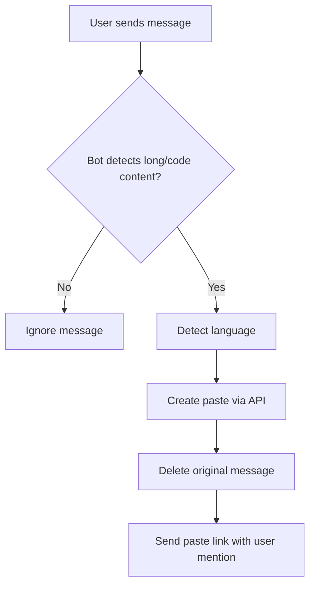

# Pastebinir Telegram Bot

A Telegram bot that automatically detects long text or code messages in groups, creates a paste using the Pastebinir API, deletes the original message, and sends the paste link.

## 🚀 Features

- **Automatic Detection**: Detects long messages (>200 characters by default) or code-like content
- **Language Detection**: Automatically detects programming languages using pattern matching
- **Message Management**: Deletes original long messages and replaces them with paste links
- **Group Only**: Only works in group chats, not private messages
- **User Mentions**: Mentions the original user who sent the message
- **Configurable**: Easy to configure via environment variables

## 📋 Table of Contents

- [Quick Start](#quick-start)
- [Installation](#installation)
- [Configuration](#configuration)
- [Usage](#usage)
- [How It Works](#how-it-works)
- [API Reference](#api-reference)
- [🔍 Troubleshooting](#-troubleshooting)
- [Development](#development)

## ⚡ Quick Start

1. **Install uv** (if not already installed):
   ```bash
   curl -LsSf https://astral.sh/uv/install.sh | sh
   ```

2. **Clone and setup**:
   ```bash
   git clone <your-repo-url>
   cd pasted-tg-bot
   uv sync
   ```

3. **Configure environment**:
   ```bash
   cp example.config.env config.env
   # Edit config.env with your bot token
   ```

4. **Start the bot**:
   ```bash
   uv run start
   ```

## 📦 Installation

### Prerequisites

- Python 3.8 or higher
- [uv](https://github.com/astral-sh/uv) package manager
- A Telegram bot token

### Step-by-Step Installation

1. **Install uv** (if not already installed):
   ```bash
   curl -LsSf https://astral.sh/uv/install.sh | sh
   ```

2. **Install project dependencies**:
   ```bash
   uv sync
   ```

## ⚙️ Configuration

### 1. Create a Telegram Bot

1. Message [@BotFather](https://t.me/botfather) on Telegram
2. Send `/newbot` and follow the instructions
3. Copy the bot token you receive

### 2. Configure Environment Variables

Copy the example configuration file and edit it:

```bash
cp example.config.env config.env
```

Edit `config.env` with your settings:

```env
# Required: Your Telegram bot token
TELEGRAM_TOKEN=your_actual_bot_token_here

# API Configuration (defaults to localhost)
PASTEBINIR_API_URL=https://pasted.ir/api/pastes/
LANGUAGES_API_URL=https://pasted.ir/api/languages/
WEBSITE_URL=http://pasted.ir

# Bot Behavior
MIN_MESSAGE_LENGTH=200
```

### 3. Bot Permissions

Add your bot to groups with these permissions:
- **Delete Messages** (required to delete original messages)
- **Send Messages** (required to send paste links)

## 🎯 Usage

### Starting the Bot

Choose one of these methods:

```bash
# Method 1: Using uv script (recommended)
uv run start

# Method 2: Direct Python execution
source config.env && python main.py

# Method 3: Using python-dotenv
uv run python -c "import os; from dotenv import load_dotenv; load_dotenv('config.env'); exec(open('main.py').read())"
```

### Bot Behavior

The bot will automatically:
1. Monitor group messages
2. Detect long messages or code content
3. Create a paste via API
4. Delete the original message
5. Send a paste link with user mention

## 🔧 How It Works

### Message Detection

The bot triggers when a message meets any of these criteria:

1. **Length**: Message is longer than `MIN_MESSAGE_LENGTH` (default: 200 characters)
2. **Code Patterns**: Message contains code-like patterns such as:
   - Code blocks (```)
   - Variable assignments (`=`, `:=`)
   - Function definitions (`def`, `function`, `func`)
   - Import statements (`import`, `require`, `include`)
   - Brackets and parentheses (`{}`, `()`, `[]`)
   - Comments (`//`, `#`, `/* */`)

### Language Detection

The bot can detect these programming languages:

| Language | Patterns |
|----------|----------|
| Python | `def`, `import`, `class`, `if __name__` |
| JavaScript | `function`, `const`, `let`, `var` |
| HTML | `<html>`, `<div>`, `<!DOCTYPE` |
| CSS | `{`, `}`, `:`, `;` |
| PHP | `<?php`, `<?=`, `function` |
| SQL | `SELECT`, `INSERT`, `CREATE` |
| Java | `public class`, `public static` |
| C++ | `#include`, `using namespace` |
| C | `#include`, `int main` |
| Bash | `#!/bin/bash`, `echo`, `if` |
| JSON | `{`, `}`, `"key"` |
| XML | `<tag>`, `<?xml` |
| YAML | `key:`, `- item` |
| Markdown | `#`, `##`, `*`, `**` |

### Process Flow



## 📚 API Reference

### Configuration Options

| Variable | Default | Description | Required |
|----------|---------|-------------|----------|
| `TELEGRAM_TOKEN` | - | Your Telegram bot token | ✅ |
| `PASTEBINIR_API_URL` | `http://localhost:8000/api/pastes/` | API endpoint for creating pastes | ❌ |
| `LANGUAGES_API_URL` | `http://localhost:8000/api/languages/` | API endpoint for fetching languages | ❌ |
| `WEBSITE_URL` | `http://localhost:8000` | Base URL for paste links | ❌ |
| `MIN_MESSAGE_LENGTH` | `200` | Minimum characters to trigger paste creation | ❌ |

### API Endpoints

The bot expects these API endpoints from your Pastebinir instance:

- `POST /api/pastes/` - Create a new paste
- `GET /api/languages/` - Get available programming languages

## 🔍 Troubleshooting

### Common Issues

#### Bot doesn't delete messages
- ✅ Make sure the bot has "Delete Messages" permission in the group
- ✅ Check that the bot is an admin or has sufficient permissions
- ✅ Verify the bot is added to the group

#### API errors
- ✅ Verify your Pastebinir API is running and accessible
- ✅ Check the API URLs in your configuration
- ✅ Ensure your Pastebinir instance has the required API endpoints
- ✅ Test API connectivity using the test script

#### Language detection issues
- ✅ The bot uses pattern matching for language detection
- ✅ If a language isn't detected, it will use the first available language from your API
- ✅ Check the language patterns in the code

#### Bot not responding
- ✅ Verify the bot token is correct
- ✅ Check that the bot is online
- ✅ Ensure the bot is added to the group
- ✅ Check logs for any error messages

### Debug Mode

Enable debug logging by setting the `DEBUG` environment variable:

```bash
DEBUG=1 uv run start
```

## 🛠️ Development

### Package Management with uv

This project uses [uv](https://github.com/astral-sh/uv) for fast Python package management:

```bash
# Install dependencies
uv sync

# Add a new dependency
uv add package-name

# Add a development dependency
uv add --dev package-name

# Update dependencies
uv lock --upgrade

# Show dependency tree
uv tree
```

### Available Scripts

The project includes several convenient scripts defined in `pyproject.toml`:

```bash
# Start the bot
uv run start

# Run tests
uv run test

# Format code
uv run format

# Lint code
uv run lint
```

### Project Structure

```
pasted-tg-bot/
├── main.py              # Main bot logic
├── pyproject.toml       # Project configuration
├── config.env           # Environment variables (create from example)
├── example.config.env   # Example configuration
├── README.md           # This file
├── nginx/              # Nginx configuration examples
│   ├── example.default.conf
│   └── example.nginx.conf
└── .gitignore          # Git ignore rules
```

### Modifying the Bot

To modify the bot behavior:

- **Detection Logic**: Edit `should_create_paste()` function in `main.py`
- **Language Patterns**: Modify `detect_language_from_content()` to add new language patterns
- **Message Length**: Update `MIN_MESSAGE_LENGTH` in config
- **API Endpoints**: Change API URLs in configuration

### Testing

```bash
# Run tests
uv run test

# Test API connectivity
python test_api.py

# Format code
uv run format

# Lint code
uv run lint
```

## 🔒 Security Notes

- The bot only works in groups, not private chats
- The bot requires delete message permissions to function properly
- All API calls are made to your own Pastebinir instance
- No message content is stored locally by the bot
- Environment variables are loaded securely

## 📝 TODO

- [ ] Migrating to aiogram 🤖
- [ ] Add more language detection patterns
- [ ] Implement rate limiting
- [ ] Add user preferences
- [ ] Support for private chats (optional)

## 📄 License

This project is licensed under the MIT License - see the LICENSE file for details.

## 🤝 Contributing

1. Fork the repository
2. Create a feature branch
3. Make your changes
4. Add tests if applicable
5. Submit a pull request

## 📞 Support

If you encounter any issues:

1. Check the [Troubleshooting](#-troubleshooting) section
2. Review the logs for error messages
3. Test your API endpoints manually
4. Open an issue on GitHub with detailed information 